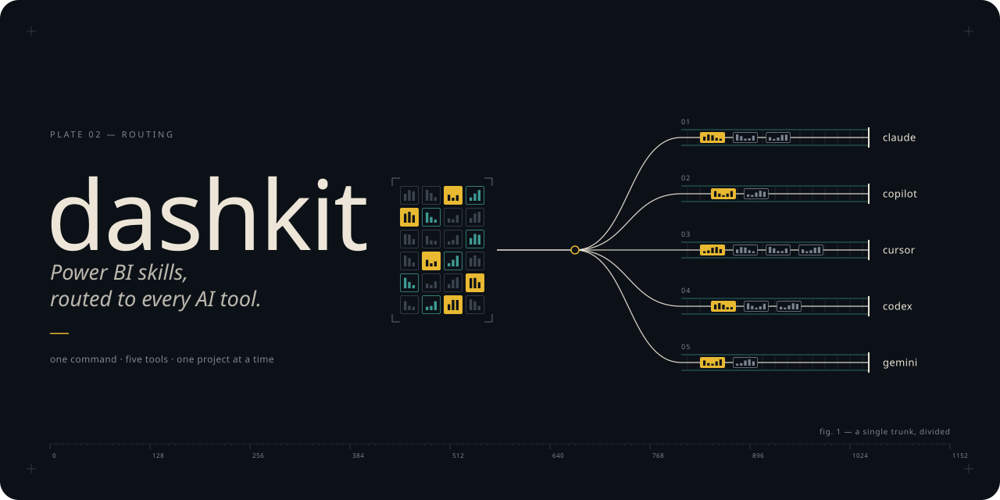

<p align="center">
  
</p>

<h1 align="center">dashkit</h1>

<p align="center">
  One command that sets up an agentic Power BI stack in the AI tools you already use.<br>
  <i>Microsoft's skills and data-goblin's guardrails, wired into Claude Code, Copilot, Cursor, Codex and Gemini — on Windows, macOS and Linux.</i>
</p>

<p align="center">
  <a href="https://github.com/leonsang/dashkit/releases/latest"></a>
  <a href="https://github.com/leonsang/dashkit/actions/workflows/ci.yml"></a>
  
  
  
  
</p>

---

dashkit doesn't write skills. It carries the good ones to wherever you work. The Power BI skills
worth having already exist — Microsoft's [skills-for-fabric](https://github.com/microsoft/skills-for-fabric)
for planning, designing and authoring reports and semantic models, and data-goblin's
[power-bi-agentic-development](https://github.com/data-goblin/power-bi-agentic-development) for the
hooks that stop an agent from writing a broken TMDL file or an unbindable report. What doesn't exist
is a way to get them into *your* tools, in *each tool's* format, with the prerequisites they
quietly depend on. That is all dashkit does.

> [!IMPORTANT]
> **Install per project, and install less.** Every skill you install competes for the agent's
> attention in every session its scope covers. dashkit installs into the current project by default
> and warns when a selection gets large; a global install of everything is something you have to ask
> for twice.

## Install

**macOS / Linux**

```bash
curl -fsSL https://raw.githubusercontent.com/leonsang/dashkit/main/install.sh | bash
```

**Windows (PowerShell)**

```powershell
irm https://raw.githubusercontent.com/leonsang/dashkit/main/install.ps1 | iex
```

**From source**, if you would rather not run a prebuilt binary (Go 1.24+):

```bash
go install github.com/leonsang/dashkit/cmd/dashkit@latest
```

The installers verify the release checksum before installing. See [Is it safe?](#is-it-safe)

## Quick start

From the folder that holds your `.pbip`:

```bash
dashkit
```

The wizard asks four things — which skills, which tools, where, which options — shows every file it
will touch and every command it will run, and only then does anything. Or skip it:

```bash
dashkit install --bundle powerbi-authoring,goblin-pbip --agents detected
```

```bash
dashkit doctor      # what is detected, what is missing, and how to fix it
dashkit list        # every bundle, who makes it, and how it installs
dashkit update      # re-apply everything recorded, from a fresh upstream copy
dashkit uninstall   # remove exactly what dashkit installed — nothing else
```

## What you can install

<!-- bundles:start -->

**From Microsoft** — downloaded at a pinned tag, written into each tool's native format.

<details>
<summary><strong>Power BI authoring</strong> &ensp;<code>powerbi-authoring</code> &ensp;Microsoft · 6 skills</summary>

Developer skills for authoring Microsoft Power BI solutions.

`check-updates` · `semantic-model-authoring` · `powerbi-report-planning` · `powerbi-report-design` · `powerbi-report-authoring` · `powerbi-report-management`

</details>

<details>
<summary><strong>Fabric — everything</strong> &ensp;<code>fabric-skills</code> &ensp;Microsoft · 27 skills</summary>

Complete bundle: all Microsoft Skills for Fabric for developers and consumers

`check-updates` · `fabriciq` · `semantic-model-authoring` · `sqldw-consumption-cli` · `sqldw-authoring-cli` · `spark-consumption-cli` · `spark-authoring-cli` · `eventhouse-cli` · `eventstream-cli` · `eventschemaset-consumption-cli` · `activator-cli` · `sqldw-operations-cli` · `sqldb-cli` · `spark-operations-cli` · `mlv-operations-cli` · `azmon-mirroredcatalogs-operations-cli` · `dataflows-cli` · `search-consumption-cli` · `fabriciq-ontology-cli` · `deployment-pipelines-authoring-cli` · `databricks-migration` · `pipeline-migration` · `synapse-migration` · `hdinsight-migration` · `e2e-medallion-architecture` · `git-integration-operations-cli` · `e2e-fabric-cost-estimation`

</details>

<details>
<summary><strong>Fabric authoring</strong> &ensp;<code>fabric-authoring</code> &ensp;Microsoft · 12 skills</summary>

Developer skills for authoring Microsoft Skills for Fabric solutions - SDKs, APIs, automation scripts, CI/CD

`check-updates` · `sqldw-authoring-cli` · `sqldb-cli` · `spark-authoring-cli` · `eventhouse-cli` · `eventstream-cli` · `activator-cli` · `semantic-model-authoring` · `dataflows-cli` · `fabriciq-ontology-cli` · `deployment-pipelines-authoring-cli` · `e2e-medallion-architecture`

</details>

<details>
<summary><strong>Fabric consumption</strong> &ensp;<code>fabric-consumption</code> &ensp;Microsoft · 12 skills</summary>

Consumer skills for interactive Microsoft Skills for Fabric operations - queries, exploration, monitoring

`check-updates` · `fabriciq` · `sqldw-consumption-cli` · `sqldb-cli` · `spark-consumption-cli` · `eventhouse-cli` · `eventstream-cli` · `eventschemaset-consumption-cli` · `activator-cli` · `dataflows-cli` · `search-consumption-cli` · `fabriciq-ontology-cli`

</details>

<details>
<summary><strong>Fabric operations</strong> &ensp;<code>fabric-operations</code> &ensp;Microsoft · 7 skills</summary>

Operations skills for diagnosing Microsoft Fabric performance and health - system views, multi-step investigation workflows

`check-updates` · `azmon-mirroredcatalogs-operations-cli` · `mlv-operations-cli` · `sqldw-operations-cli` · `sqldb-cli` · `spark-operations-cli` · `git-integration-operations-cli`

</details>

**From data-goblin** — installed through Claude Code's or Copilot CLI's own plugin manager.

<details>
<summary><strong>PBIP guardrails</strong> &ensp;<code>goblin-pbip</code> &ensp;data-goblin · 3 skills · 3 guardrail hooks</summary>

Checks PBIR structure, TMDL syntax and report-to-model binding automatically after every edit, with PBIR and TMDL format references. Ships native validators for macOS, Linux and Windows.

Checks that run automatically, without being asked:

- PBIR structure and schema, after any edit inside a .Report folder
- TMDL syntax, after any .tmdl edit
- report-to-model binding, after definition.pbir edits

`pbip` · `pbir-format` · `tmdl`

</details>

<details>
<summary><strong>Live model guardrails</strong> &ensp;<code>goblin-pbi-desktop</code> &ensp;data-goblin · 1 skill · 3 guardrail hooks</summary>

Connects to an open Power BI Desktop model and checks DAX references, measure metadata and referential integrity as the agent changes it. Windows only, with Power BI Desktop running.

Checks that run automatically, without being asked:

- DAX references resolve to real tables, columns and measures
- new measures carry a display folder, description and format string
- referential integrity after relationship or key-column changes

`connect-pbid`

</details>

<details>
<summary><strong>Semantic model craft</strong> &ensp;<code>goblin-semantic-models</code> &ensp;data-goblin · 6 skills</summary>

DAX, Power Query, naming conventions, lineage analysis and refresh, with an auditor agent that reviews a whole model.

`dax` · `lineage-analysis` · `power-query` · `refresh-semantic-model` · `semantic-model` · `standardize-naming-conventions`

</details>

<details>
<summary><strong>Report craft</strong> &ensp;<code>goblin-reports</code> &ensp;data-goblin · 5 skills</summary>

Report creation and design, theme JSON, report review and pbir-cli, with reviewer agents for Deneb, SVG, R and Python visuals.

`create-pbi-report` · `modifying-theme-json` · `pbi-report-design` · `pbir-cli` · `review-report`

</details>

<details>
<summary><strong>Tabular Editor</strong> &ensp;<code>goblin-tabular-editor</code> &ensp;data-goblin · 5 skills</summary>

Best Practice Analyzer rules, C# scripting and Tabular Editor 2/3 CLI automation.

`bpa-rules` · `c-sharp-scripting` · `te-cli` · `te-docs` · `te2-cli`

</details>

Full tables with every skill's description: [docs/bundles.md](docs/bundles.md).

<!-- bundles:end -->

## How each tool is handled

Tools with a real skill loader get real skills. Tools that only read instruction files get the
bundle vendored into `.dashkit/` plus one always-on rules file that indexes it, so the skills'
reference files stay reachable instead of being flattened away. data-goblin's bundles go through the
tool's own plugin manager, or nowhere.

| Tool | Microsoft skills land in | MCP servers | data-goblin |
|---|---|---|---|
| Claude Code | its plugin manager, else `.claude/skills/` | `.mcp.json` | ✓ plugin manager |
| GitHub Copilot CLI | its plugin manager (global), else instructions | host config | ✓ global only |
| GitHub Copilot in VS Code | `.github/instructions/` + chat modes | `.vscode/mcp.json` | — |
| Cursor | `.cursor/rules/*.mdc` | `.cursor/mcp.json` | — |
| Codex CLI | managed block in `AGENTS.md` | `.codex/config.toml` | — |
| Gemini CLI | managed block in `GEMINI.md` | `.gemini/settings.json` | — |
| Windsurf ⚠ | `.windsurf/rules/` | `~/.codeium/windsurf/mcp_config.json` | — |
| OpenCode ⚠ | `.opencode/skill/` | written down for you | — |

Project paths shown; every global path, and the documentation each was verified against, is in
[docs/targets.md](docs/targets.md).

> [!WARNING]
> ⚠ **Windsurf and OpenCode are experimental.** Their layouts haven't been re-verified against
> current documentation, so dashkit only touches them with `--experimental`. Rather than guess at
> someone's config, it leaves them alone.

## Is it safe?

dashkit edits files you own, so it is built to be boring about it:

- **Backups first.** Every file is copied to `~/.dashkit/backups/<timestamp>/` before it is touched.
- **Surgical edits.** JSON is merged key by key in its original order, TOML tables are added as
  text, and shared Markdown files get one `<!-- dashkit:start -->` block and nothing else.
- **Idempotent.** Running the same install twice leaves every file byte-identical. A test enforces it.
- **Nothing hidden.** `--dry-run` prints the full plan; every command is shown and confirmed.
- **Precise uninstall.** `~/.dashkit/state.json` records each file created, key added and plugin
  installed, and `dashkit uninstall` reverses exactly those.

The binary is built by GoReleaser in this repository's own GitHub Actions, from the tagged source,
and `checksums.txt` ships with every release. It *does* reach the network (to download the pinned
skills) and *does* run commands (package managers, host plugin managers), which is why each command
is printed and confirmed first. Details, including what we checked about third-party binaries that
data-goblin's hooks run, are in [docs/safety.md](docs/safety.md).

## Credits

dashkit is plumbing. The skills belong to their authors: **Microsoft** (skills-for-fabric, MIT) and
**Kurt Buhler / Data Goblins** (power-bi-agentic-development, GPL-3.0, installed through your tool's
plugin manager, never copied). See [ATTRIBUTIONS.md](ATTRIBUTIONS.md). Report problems with a
skill's *content* to its project; problems with how dashkit installed it, here.

## Development

```bash
go test ./...                                 # unit tests + full install/uninstall round trips
go run ./cmd/dashkit --home /tmp/dk doctor    # --home sandboxes both dashkit and every ~/ path
node tools/gen-manifest.mjs <skills-for-fabric> v0.3.11 --goblin <power-bi-agentic-development>
node tools/gen-docs.mjs <skills-for-fabric>   # regenerates docs/bundles.md and the list above
```

CI runs the suite and a real install/uninstall against the upstream tree on Ubuntu, macOS and
Windows. See [CONTRIBUTING.md](CONTRIBUTING.md) for adding a tool.

## License

MIT for dashkit. Each bundle keeps its own licence — see [ATTRIBUTIONS.md](ATTRIBUTIONS.md).
